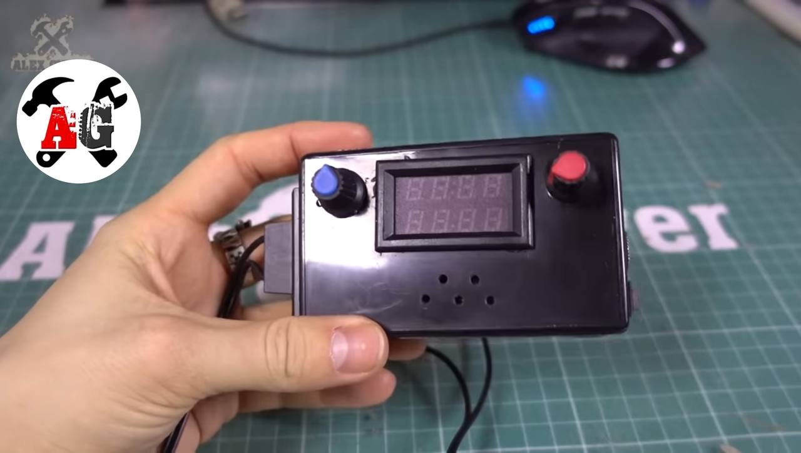

### 🛠️ Personal Projects

#### 🔋 Mini Lab Power Supply (Mini LBP v2.0)

A custom-built compact laboratory power supply based on [AlexGyver’s Mini LBP v2.0](https://alexgyver.ru/lbp/), designed for versatility, portability, and reliable power delivery for electronics prototyping and testing.

**Project Overview:**  
This version features three independent outputs: a variable **1.25–30V 5A** regulated channel based on the **XL4015 buck converter**, and two fixed outputs at **12V 3A** and **5V 3A**, each with its own dedicated toggle switch. The power supply is fed by a standard laptop charger and includes a digital display for voltage and current monitoring.

**Key Features:**
- **Adjustable voltage and current control** via dual potentiometers (10kΩ each)
- **Real-time readout** of voltage and current using a built-in digital voltmeter/ammeter display (common current + separate voltage sensing)
- **Three output ports (5.5×2.5mm jacks):**
  - 1.25–30V @ 5A (adjustable)
  - 12V @ 3A (step-down converter)
  - 5V @ 3A (step-down converter)
- **Compact and functional wiring layout**, enabling safe and organized distribution of power
- **Manual toggle switches** to control each output independently
- Powered via **DC barrel jack** from a 30V laptop charger input
- Built-in cooling fan control (optional)

**What I did:**
- Assembled the circuit following the schematic and wiring layout from v2.0
- Soldered all connections and ensured stable, short-circuit-protected outputs
- Installed and calibrated potentiometers for fine control over voltage and current
- Mounted all components in a space-efficient enclosure

**Skills Gained:**
- Understanding and implementing buck converters and power regulation
- Safe wiring practices for high-current, low-voltage systems
- Analog signal tuning for potentiometer-based control
- Working with digital display modules for real-time monitoring
- Practical experience with multi-voltage power design and load testing

---

#### 🌡️ Smart Weather & CO₂ Clock (MeteoClock)

A feature-rich, microcontroller-based alarm clock that displays real-time environmental data alongside the current time. Inspired by [AlexGyver’s MeteoClock project](https://alexgyver.ru/meteoclock/), this device combines multiple sensors and a graphical display to monitor indoor air quality and weather conditions.

**What I built:**
- A smart clock powered by a **DS3231 RTC module** for accurate timekeeping, enhanced with a **BME280 sensor** (temperature, humidity, pressure) and an **MH-Z19B sensor** for CO₂ monitoring.
- A **2.4” TFT display** to present time, weather, and CO₂ concentration with animated graphics and dynamic layout.
- Features include **auto-brightness control**, **alarm modes** (LED blink or vibration motor), and optional **data logging to an SD card**.
- Enclosed in a custom-designed case for aesthetic appeal and durability.

**What I learned:**
- Worked with multiple I²C and UART sensors simultaneously and optimized their integration into a single Arduino-based program.
- Developed a real-time user interface using graphical libraries for the TFT screen.
- Gained experience in power optimization, display refresh control, and environmental data interpretation.
- Understood the importance of indoor air quality and implemented visual feedback for CO₂ safety thresholds.